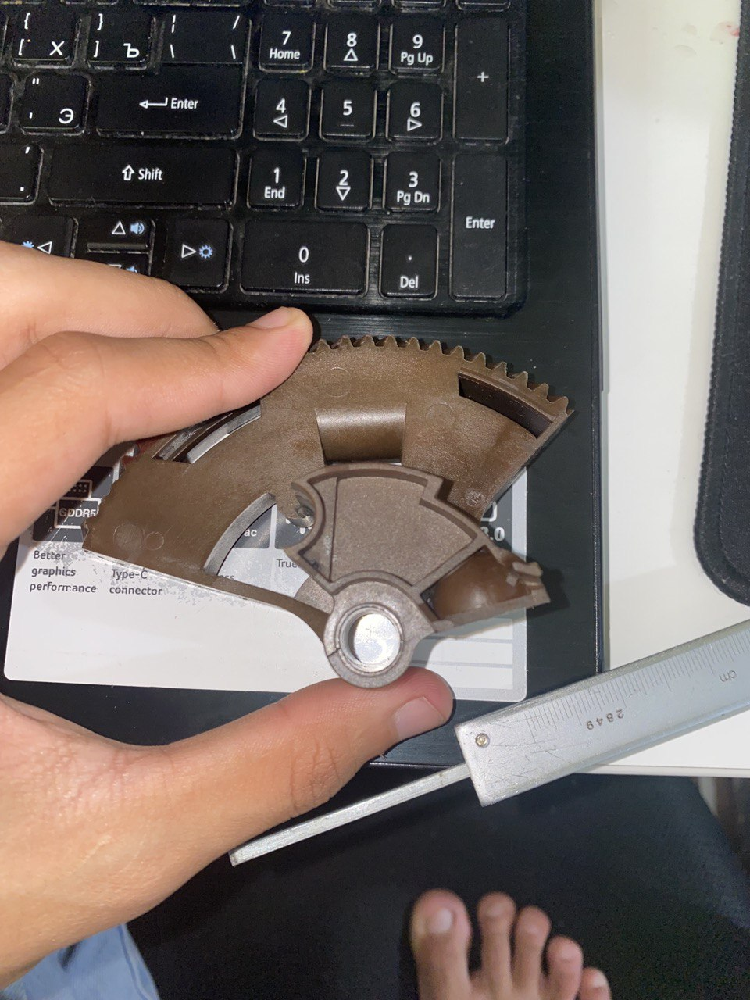

# Jahongir Rustamov
## Junior Frontend developer

### Contact information

* __Phone:__ +998 90 694 20 40
* __Email:__ rusatamovjm001@gmail.com
* __Telegram:__ @rustamovv017
* [Linkedln](https://ydmitry.ru/blog/rukovodstvo-po-markdown-dlya-uproshcheniya-veb-razrabotki/)
* [Behance](https://ydmitry.ru/blog/rukovodstvo-po-markdown-dlya-uproshcheniya-veb-razrabotki/)

********* 

### Briefly about nyself:

#### Having started my career as a layout designer in a local newspaper with minimum skills, I became profficient in printing design. My keen interest in printing technologies led me to working as a Prepress and DTP Engineer in the largest printing house in my city,where I continued self-learning, examining the process of creating wine and food labels, magazines and other printed goods.

#### Three years ago I’ve become passionate about retouching. I’ve mastered different retouching techniques,learned to work with graphic tablet, become an advanced Photoshop user and found my first job as a retoucher.Remote work as a retoucher gives me extra free time, which I spend learning Frontend Development.I’m interested in Web Development because this occupation provides endless possibilities for professional growth,besides there’s a huge amount of free high quality resources for self-education and a large community of developers.

#### I believe, that my ability to learn and to gain new skills will lead me through this path of becoming a proficient Frontend Developer.

********* 
### Skills and Proficiency:

* HTML
* CSS
* JAVASCRIPT
* PYTHON
* Adobe Photoshop, Illustrator, InDesign

=====

### Courses
* HTML and CSS Tutorials on the w3schools (completed)

